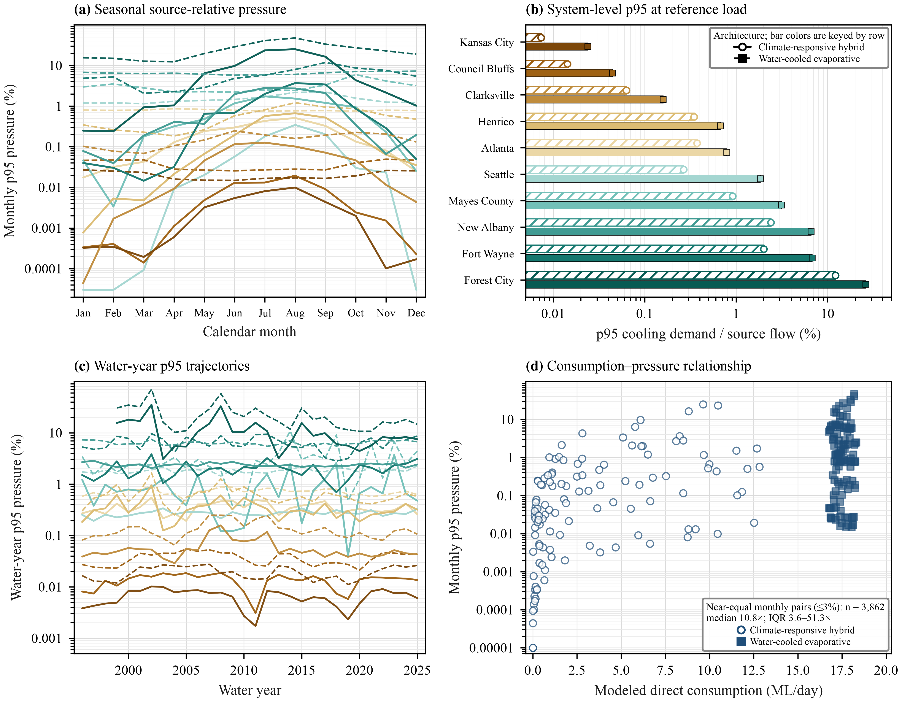

# Where Data Centers Run

Hydrologic analysis and derived data for evaluating how data-center water demand relates to the water systems that supply it.



## What the analysis shows

- Twenty operating U.S. locations were audited for a documented chain linking the location, water provider, supply system, and a representative hydrological record. Ten systems met all four evidence requirements.
- At a common modeled consumptive demand of 17.5 ML d⁻¹, the 95th-percentile percentage of source flow ranged from 0.0246% for the Kansas City Missouri River component to 25.55% for the Second Broad River at Forest City.
- The reference-load analysis spans 50, 100, 250, 400, and 500 MW, corresponding to 3.5–35.0 ML d⁻¹ under the stated linear scaling. The source ordering is unchanged across this range.
- Location accounts for 93.7% of the log-scale variation in the central p95 comparison, compared with 5.8% for cooling architecture. Among monthly cases with nearly equal modeled demand, the median source-flow contrast is 10.82-fold.

These percentages are comparative hydrological indicators. They do not measure water legally or physically available to a facility, utility capacity, ecological impact, or sustainable development capacity.

## Repository contents

| Path | Contents |
|---|---|
| `analysis/` | Reproducible Python analysis and release validation |
| `data/derived/` | Report-derived water, energy, cooling, source-system, and hydrological tables |
| `data/provenance/` | Source register with URLs, locators, verification notes, and analytical boundaries |
| `results/` | Recomputed summaries, rankings, headline statistics, and 50–500 MW sensitivity results |
| `figures/` | One representative result graphic |

## Reproduce the results

Python 3.10 or newer is recommended.

```bash
python -m venv .venv
source .venv/bin/activate
python -m pip install -r requirements.txt
python run_all.py
```

The final command rebuilds the result tables and ends with a validation `PASS`. The 50–500 MW output is written to [`results/reference_load_sensitivity_50_500_mw.csv`](results/reference_load_sensitivity_50_500_mw.csv).

## Analytical design

The release keeps distinct quantities separate:

1. Reported withdrawal, discharge, and estimated consumption retain the definitions and spatial boundaries of their original reports.
2. Facility water intensity uses total-facility electricity and is not labeled WUE.
3. Regional WUE uses the operator-reported IT-electricity denominator.
4. Source-flow pressure divides a specified direct consumptive demand by observed flow for a documented source component.
5. Managed municipal and reuse systems are presented as system cases; their pathways are not assigned to individual facilities.

The source-flow analysis uses 27–30 years of daily records ending 30 September 2025. Clarksville omits 35 incomplete days, New Albany omits two missing dates without interpolation, and Forest City contributes 27 complete water years. Restricting all systems to the common 27-year period changes every p95 estimate by less than 5% and does not change the ordering.

## Data provenance and reuse

The machine-readable source register identifies the official report, public URL, page or dataset locator, verification status, and scientific boundary for each retained source. Large reports and complete third-party databases are not redistributed. See [`data/README.md`](data/README.md) and [`LICENSE`](LICENSE) before reuse.

## Citation

Use [`CITATION.cff`](CITATION.cff) or GitHub’s **Cite this repository** menu.
